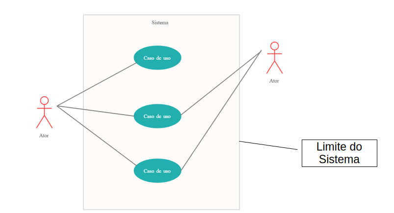
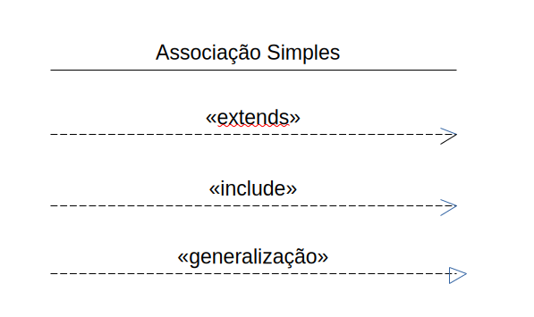
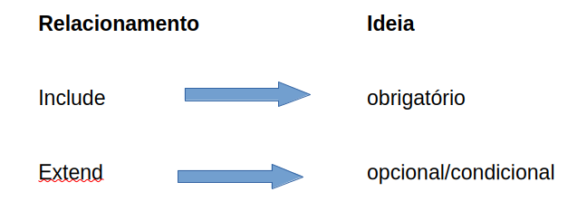
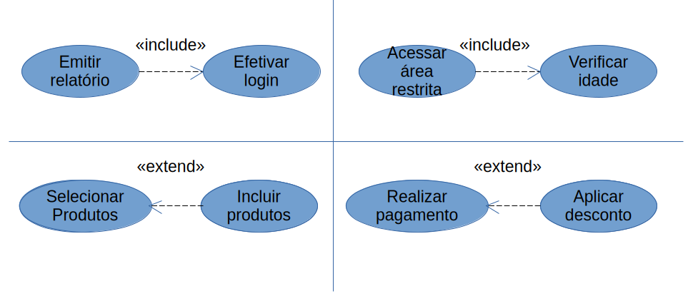
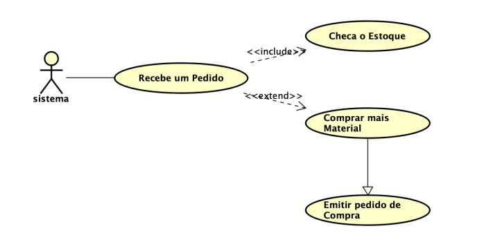
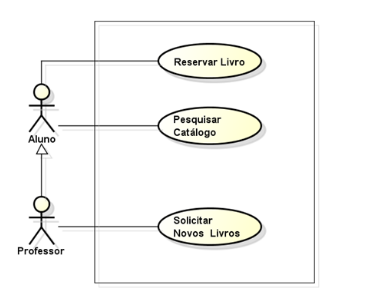

# UML: Caso de Uso

## O que é UML?
A UML (Unified Modeling Language) é uma linguagem padronizada usada para modelar sistemas de software.

Ela não é uma linguagem de programação.

**A UML serve para:**
- visualizar
- documentar
- planejar
- comunicar
- analisar sistemas

Ela possui diversos diagramas, como:
* Casos de Uso
* Classes 
* Sequência 
* Atividades 
* Estados 
* Componentes

---

## O que é um Caso de Uso?
Um Caso de Uso representa:

uma funcionalidade do sistema vista pela perspectiva do usuário.

Ou seja:

o que o usuário deseja fazer no sistema,
quais serviços o sistema oferece,
como o usuário interage com o sistema

**Exemplos:**
- Realizar login
- Emitir boleto
- Cadastrar aluno

## Elementos principais do Diagrama de Casos de Uso

### 1. Ator

Representa quem interage com o sistema.

**Pode ser:**  pessoa, outro sistema, dispositivo. 

**Exemplos:**
- Cliente
- Professor
- Sistema bancário 
- Administrador

### 2. Caso de Uso

Representa uma funcionalidade do sistema.

É normalmente escrito com verbo no infinitivo:
- Cadastrar Cliente
- Emitir Relatório 
- Consultar Estoque

### 3. Relacionamento

Mostra a interação entre ator e caso de uso.

O mais comum é a associação: linha ligando ator ao caso de uso.

**Casos de uso representam objetivos do usuário, Não representam telas.**

* **ERRADO:** Tela de Login, Página Inicial 
* **CORRETO:**Autenticar Usuário, Consultar Produtos

---

## Relacionamentos/Associações

Além da associação simples entre ator e caso de uso, existem relacionamentos especiais muito importantes:

### \<\<include\>\>                                                                                    

**Significa:** um caso de uso **SEMPRE** reutiliza outro.

**Ideia principal do include**

Serve para:
- reutilizar comportamento
- evitar repetição
- representar algo obrigatório

**Exemplo**
* Caso de uso:
    - Finalizar Compra 
    * Para finalizar compra, SEMPRE é necessário:
        - Autenticar Usuário

### \<\<extend\>\>

**Significa:** um comportamento opcional ou condicional.

**Exemplo**
* Caso principal:
    - Realizar Compra 
    * Às vezes pode ocorrer:
        - Aplicar Cupom de Desconto

### Generalização/Herança

Ela ocorre quando um ator mais específico herda comportamentos de um ator mais geral.

**Exemplo**
* **Imagine:** 
    - Aluno 
    - Professor 

Aluno e Professor são tipos de Usuário, mas professor possui além das mesmas ações que aluno, ações exclusivas
