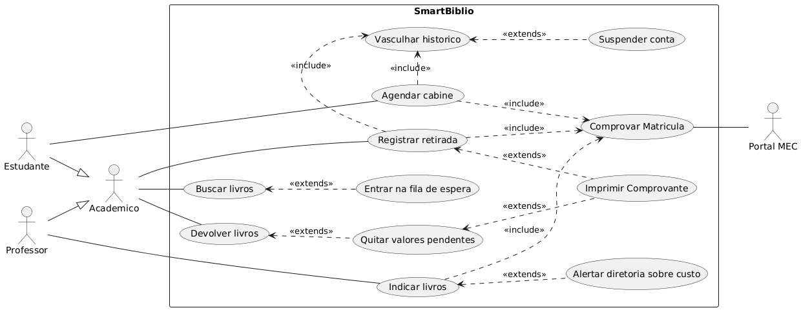

## Sistema "SmartBiblio" - Biblioteca Universitária

O IFPR está desenvolvendo o SmartBiblio, um novo sistema de autoatendimento para a biblioteca. O sistema atende a qualquer pessoa que possua vínculo com a instituição (acadêmicos). O público geral tem acesso ao terminal para buscar livros no catálogo e para registrar a retirada de livros nas máquinas de autoatendimento, além de quitar valores pendentes quando devolvem livros com atraso. Se ao buscar um livro a pessoa perceber que todos os exemplares estão emprestados, o sistema oferece a oportunidade de entrar na fila de espera, caso a pessoa deseje.

Dentro dessa grande comunidade acadêmica, temos *dois perfis com necessidades bem específicas*:

* **Os Estudantes**, que além das funções básicas que todos têm, possuem a funcionalidade exclusiva de agendar cabines individuais para a época de provas.

* **Os Professores**, que possuem a exclusividade de indicar a compra de novos títulos para compor a bibliografia de suas disciplinas. Em situações excepcionais, se o livro indicado pelo professor for classificado como *"Importado/Alto Custo"*, o sistema aciona uma rotina para alertar a diretoria de ensino sobre a compra.

O SmartBiblio possui **regras de segurança e auditoria** muito rígidas:

* Absolutamente todas as ações que envolvem reserva de recursos ou saída de materiais (ou seja, registrar a retirada do livro, agendar a cabine e indicar a compra de títulos) obrigam o sistema a se comunicar em tempo real com o Portal Acadêmico do MEC (um serviço externo do governo) para comprovar que a matrícula está ativa naquele semestre. Sem essa validação, a ação não prossegue.

* Além disso, toda vez que alguém tenta registrar a retirada de um livro ou agendar uma cabine, o sistema é obrigado a vasculhar o histórico do usuário buscando infrações. Se durante essa varredura o sistema encontrar livros não devolvidos há mais de 30 dias, ele irá suspender a conta daquele usuário imediatamente.

* Por fim, como medida de transparência, logo após registrar a retirada de um livro ou quitar um valor pendente, o sistema pergunta se a pessoa deseja imprimir o comprovante em papel.

### Atividade:

Modele o Diagrama de Casos de Uso deste sistema. 

O diagrama deve conter **exatamente 4 atores** (utilizando o conceito de Herança/Generalização onde couber) e **12 Casos de Uso**. Tenha extrema atenção aos relacionamentos de Inclusão (`<<include>>`) e Extensão (`<<extend>>`).

