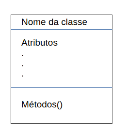
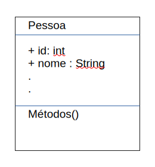
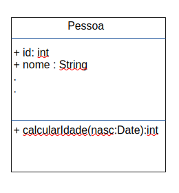
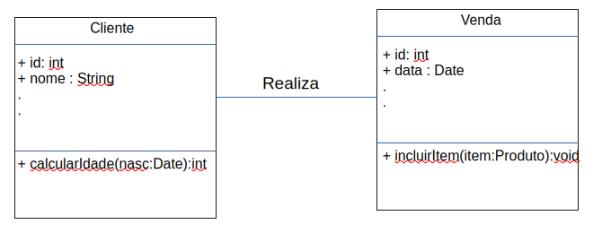
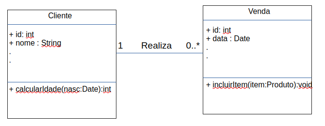

# UML: Diagrama de Classes

Ele descreve a estrutura estática de um sistema, mostrando suas classes, atributos, métodos e os relacionamentos existentes entre elas.

Seu objetivo é representar como os elementos do sistema estão organizados e como interagem entre si.

---

## Estrutura da Classe

Uma classe é normalmente representada por um retângulo dividido em três partes:



### Atributos

Representam as características ou dados armazenados pela classe.

**Sintaxe:**

```
visibilidade nome: tipo
```

**Exemplo:**

```
- nome: String
- cpf: String
- idade: int
```

#### Visibilidade

Define o nível de acessibilidade de atributos e métodos. 

Ela é **indicada por um símbolo** colocado antes do nome do elemento, garantindo o encapsulamento e o controle de acesso no design orientado a objetos.

| Símbolo | Visibilidade | Significado |
|---------|--------------|-------------|
| `+` | Pública | Acessível por qualquer classe |
| `-` | Privada | Acessível apenas pela própria classe |
| `#` | Protegida | Acessível pela classe e subclasses |
| `~` | Pacote | Acessível dentro do mesmo pacote |



### Metodos

Representam os comportamentos da classe.

**Sintaxe:**

```
visibilidade nome(parâmetros[nome: tipo]): tipoRetorno
```

**Exemplo:**

```
+ calcularIdade(nasc: Date): int
+ realizarCompra(): void
```



---

## Relacionamentos entre Classes

Representados por diferentes setas(a seta sempre aponta para o todo)

### Associação

Representa um relacionamento simples e estrutural entre classes.

**Exemplo:**

```
Cliente -------- Venda
```

Significa que um cliente possui ou realiza venda.



### Multiplicidade

Indica quantas instâncias de uma classe podem se relacionar com outra.

| Notação | Significado |
|----------|-------------|
| `1` | Exatamente um |
| `0..1` | Zero ou um |
| `*` | Muitos |
| `0..*` | Zero ou muitos |
| `1..*` | Um ou muitos |
| `m..n` | Intervalo específico |



Um cliente pode possuir ou realizar várias vendas.

### Herança/Generalização

Representa a relação entre uma classe mais geral e suas subclasses.

**Representação:**

```
────────-▷
```

Exemplo:

```
Carro ────────-▷ Veiculo

Gerente ────────-▷ Usuario
```

As subclasses Carro e Gerente herda os atributos e metodos das superclasses Veiculo e Usuario, respectivamente.

### Agregação

Representa uma relação "todo-parte", em que as partes podem existir independentemente do todo.

**Representação:**

```
◇────────
```

**Exemplo:**

```
Biblioteca ◇──────── Livro
```

Um livro pode existir sem estar em uma biblioteca

### Composição

É uma forma mais forte de agregação. As partes dependem da existência do todo.

**Representação:**

```
◆────────
```

Exemplo:

```
Venda ◆──── ItemVenda
```

Se a venda for excluído, seus itens também deixam de existir.

### Dependência

Indica que uma classe utiliza temporariamente outra classe.

**Representação:**

```
- - - - - >
```

**Exemplo:**

```
Venda - - - - > EmailService
```

Mudanças na classe utilizada podem impactar a classe dependente.

---

## Tipos de Classes

### Classe Comum (Concreta)

A **classe comum**, também chamada de **classe concreta**, é aquela que pode ser instanciada normalmente, ou seja, é possível criar objetos a partir dela.

Ela possui atributos e métodos implementados para representar entidades reais do sistema.


### Classe Abstrata <<abstract>>

Uma **classe abstrata** é uma classe que **não pode ser instanciada diretamente**. 

Ela serve como modelo para outras classes, reunindo características e comportamentos comuns que serão herdados pelas subclasses.

Pode possuir tanto métodos implementados quanto métodos abstratos (sem implementação).

**Representação:**

```
────────-▷ 
```

**Exemplo:**

```
Cliente ────────-▷ Usuario
```

### Interface <<interface>>

Uma **interface** define um conjunto de operações que outras classes devem implementar, representando capacidade/comportamento.

Ela especifica as assinaturas, determinando quais métodos uma classe deve possuir, sem fornecer necessariamente suas implementações.

**Representação:**

```
- - - - -▷ 
```

**Exemplo**

```
Usuario - - - - -▷ Autenticavel
```