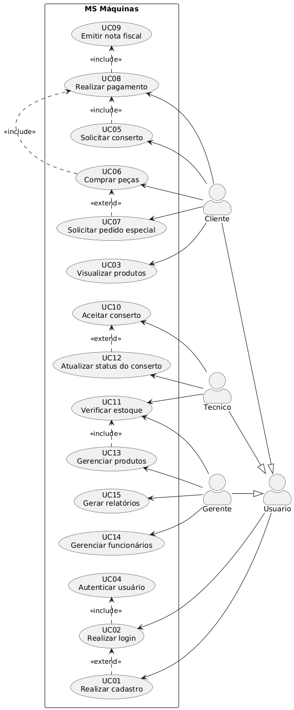

# Documento de Casos de Uso – Sistema MS Máquinas

# Caso de Uso UC01 – Realizar Cadastro

## Nome

Realizar Cadastro

## Objetivo

Permitir que um usuário realize seu cadastro no sistema MS Máquinas para ter acesso às funcionalidades disponíveis de acordo com seu perfil.

## Atores

* Usuário

## Pré-condições

* O usuário não pode possuir cadastro ativo no sistema.
* O sistema deve estar disponível para novos cadastros.

## Pós-condições

* A conta do usuário é criada com sucesso.
* Os dados do usuário são armazenados no banco de dados.
* O usuário fica apto a realizar login no sistema.

## Fluxo Principal

1. O usuário acessa a opção "Cadastrar-se".
2. O sistema apresenta o formulário de cadastro.
3. O usuário informa os dados solicitados.
4. O sistema valida os dados preenchidos.
5. O usuário confirma o envio do formulário.
6. O sistema registra as informações fornecidas.
7. O sistema cria a conta do usuário.
8. O sistema exibe uma mensagem confirmando o sucesso do cadastro.
9. O usuário é orientado a realizar o login para acessar o sistema.

## Fluxos Alternativos

*FA01 – Alterar dados antes da confirmação*

No passo 5 do Fluxo Principal.

1. Antes de confirmar o cadastro, o usuário percebe que alguma informação está incorreta.
2. O usuário retorna ao formulário e realiza as alterações necessárias.
3. O sistema atualiza os dados preenchidos.
4. O fluxo retorna ao passo 5 do Fluxo Principal.

*FA02 – Cancelar o cadastro*

No passo 5 do Fluxo Principal.

1. O usuário decide não prosseguir com o cadastro.
2. O usuário seleciona a opção de cancelamento.
3. O sistema descarta as informações não salvas.
4. O caso de uso é encerrado sem a criação da conta.

*FA03 – Cadastro com preenchimento parcial*

No passo 3 do Fluxo Principal:

1. O usuário preenche apenas parte do formulário.
2. O sistema mantém os dados já digitados durante a sessão.
3. O usuário completa as informações pendentes.
4. O fluxo retorna ao passo 4 do Fluxo Principal.

## Fluxos de Exceções

*FE01 – CPF já cadastrado*

No passo 4 do Fluxo Principal.

1. O sistema identifica que o CPF informado já está associado a uma conta existente.
2. O sistema informa ao usuário que o cadastro não pode ser concluído.
3. O usuário pode informar outro CPF válido ou acessar a opção de recuperação de acesso.
4. O fluxo retorna ao passo 3 do Fluxo Principal.

*FE02 - E-mail já utilizado*

No passo 4 do Fluxo Principal.

1. O sistema verifica que o endereço de e-mail informado já está cadastrado.
2. O sistema apresenta uma mensagem de erro.
3. O usuário pode informar outro e-mail.
4. O fluxo retorna ao passo 3 do Fluxo Principal.

*FE03 - Dados obrigatórios inválidos ou incompletos*

No passo 4 do Fluxo Principal.

1. O sistema identifica campos obrigatórios não preenchidos ou preenchidos incorretamente.
2. Os campos com inconsistências são destacados.
3. O sistema apresenta mensagens indicando os erros encontrados.
4. O usuário corrige as informações.
5. O fluxo retorna ao passo 3 do Fluxo Principal.

*FE04 - Senha fora dos critérios estabelecidos*

No passo 4 do Fluxo Principal.

1. O sistema verifica que a senha não atende aos requisitos mínimos de segurança.
2. O sistema informa os critérios exigidos.
3. O usuário define uma nova senha.
4. O fluxo retorna ao passo 3 do Fluxo Principal.

*FE05 - Falha ao registrar o cadastro*

No passo 6 do Fluxo Principal.

1. O sistema encontra uma falha interna ao salvar os dados do usuário.
2. O sistema informa que não foi possível concluir o cadastro naquele momento.
3. Nenhuma conta é criada.
4. O usuário é orientado a tentar novamente mais tarde.
5. O caso de uso é encerrado.

## Regras de Negócio

*RN01 - Dados essenciais unicos*

O CPF deve ser único no sistema, e o e-mail cadastrado deve ser único para cada usuário.

*RN02 - Requisitos de segurança*

* A senha deve possuir no mínimo 8 caracteres, contendo letras e números.
* Os dados pessoais sensiveis devem ser armazenados com criptografia.

*RN03 - Autenticação*

O usuário somente poderá acessar as funcionalidades do sistema após realizar o login.

---

# Caso de Uso UC05 – Solicitar Conserto

## Nome

Solicitar Conserto

## Objetivo

Permitir que o cliente solicite o reparo de uma máquina, informando os dados necessários para análise e execução do serviço.

## Atores

- Cliente

## Pré-condições

- O cliente deve estar cadastrado no sistema.
- O cliente deve estar autenticado (login realizado).

## Pós-condições

- A solicitação de conserto é registrada no sistema.
- A ordem de serviço é criada com o status "Aguardando análise".

## Fluxo Principal

1. O cliente acessa a opção "Solicitar Conserto".
2. O sistema solicita os dados da máquina e a descrição do problema.
3. O cliente informa os dados solicitados.
4. O sistema valida os dados informados
5. O sistema registra a solicitação.
6. O sistema gera uma ordem de serviço.
7. O sistema apresenta a confirmação do pedido ao cliente.

## Fluxos Alternativos

*FA01 - Anexos Opcionais*

No passo 2 do fluxo principal:

1. O cliente anexa fotos, videos e documentos da maquina.
2. Retorna para o passo 3 do fluxo principal.

## Fluxos de Exceções

*FE01 - Falta de dados*

No passo 4 do fluxo principal:

1. O cliente não informa os todos os dados obrigatorios solicitados.
2. O sistema exibe uma mensagem de aviso.
3. O sistema solicita novamente os dados.

## Regras de Negócio

*RN04 - Campos obrigatorios*

Toda solicitação deve possuir dados da maquina e descrição do defeito.

*RN05 - Registro de serviço*

Cada solicitação deve gerar uma ordem de serviço única, para registro de historico do cliente.

---

# Caso de Uso UC06 – Comprar Peças

## Nome

Comprar Peças

## Objetivo

Permitir que o cliente realize a compra de peças disponíveis no estoque.

## Atores

- Cliente

## Pré-condições

- Cliente cadastrado e autenticado.
- Existência de peças no estoque.

## Pós-condições

- A venda é registrada.
- O estoque é atualizado.
- O pagamento é associado à compra.

## Fluxo Principal

1. O cliente visualiza os produtos disponíveis.
2. Seleciona as peças desejadas.
3. Informa a quantidade de cada item.
4. O sistema calcula o valor total.
5. O cliente confirma a compra.
6. O sistema atualiza o estoque.
6. O sistema encaminha para o pagamento.
7. O cliente realiza o pagamento.
8. O sistema confirma o pagamento.
9. A venda é realizada.

## Fluxos Alternativos

*FA01 - Pedido Especial*

No passo 2 do fluxo principal:

1. O cliente percebe a falta de um item desejado.
2. O cliente acessa "Realizar pedido especial".
3. O sistema redireciona o cliente para uma nova tela.  

*FA02 – Continuar comprando*

No passo 5 do Fluxo Principal:

1. O cliente decide adicionar novos produtos ao carrinho.
2. O sistema retorna à listagem de produtos.
3. O cliente seleciona novos itens.
4. O fluxo retorna ao passo 4 do Fluxo Principal.

*FA03 - Desconto Aplicado*

No passo 4 do fluxo principal:

1. CLiente informa um cupom de desconto para a venda.
2. Sistema recalcula o valor total da venda.
3. O fluxo retorna ao passo 5 do fluxo principal.

## Fluxos de Exceções

*FE3 – Produto indisponível durante a finalização*

No passo 5 do Fluxo Principal:

1. Antes da conclusão do pedido, o sistema detecta que o estoque foi alterado por outra operação.
2. O sistema informa que um ou mais produtos ficaram indisponíveis.
3. Os itens indisponíveis são removidos ou ajustados conforme a quantidade restante.
4. O cliente revisa o carrinho atualizado.
5. O fluxo retorna ao passo 7 do Fluxo Principal.

## Regras de Negócio

*RN06 - Limite do estoque*

Não é permitido vender quantidade superior ao estoque disponível.

*RN07 - COnfirmação de pagamento*

A venda somente é concluído após a confirmação do pagamento.

---

# Caso de Uso UC10 – Aceitar Conserto

## Nome

Aceitar Conserto

## Objetivo

Permitir que o técnico aceite uma ordem de serviço para iniciar o atendimento.

## Atores

- Técnico

## Pré-condições

- Deve existir uma ordem de serviço aguardando atendimento.
- O técnico deve estar autenticado.

## Pós-condições

- A ordem de serviço é atribuída ao técnico.
- O status é alterado para "Em manutenção".

## Fluxo Principal

1. O técnico visualiza as ordens disponíveis.
2. Seleciona uma ordem de serviço.
3. O sistema exibe os detalhes da solicitação, incluindo dados do cliente.
4. O técnico verifica as informações apresentadas.
5. O técnico confirma o aceite do conserto.
6. O sistema associa a ordem de serviço ao técnico responsável.
7. O sistema registra a data e hora do aceite.
8. O sistema altera o status da ordem para "Em manutenção".

## Fluxos Alternativos

*FA01 – Solicitar informações complementares*

No passo 4 do Fluxo Principal.

1. O técnico identifica que as informações fornecidas pelo cliente são insuficientes para iniciar o diagnóstico.
2. O técnico registra uma solicitação de informações adicionais.
3. O sistema altera o status da ordem para "Aguardando informações do cliente".
4. O cliente é notificado sobre a necessidade de complementar os dados.
5. O fluxo é suspenso até o cliente fornecer as informaçoes.

*FA02 – Recusar o atendimento*

NO passo 5 do Fluxo Principal.

1. O técnico decide não aceitar o conserto.
2. O sistema solicita uma justificativa.
2. O técnico informa o motivo da recusa.
3. O sistema registra a justificativa.
4. A ordem permanece disponível para outro técnico.
5. O caso de uso é encerrado.

## Fluxos de Exceções

*FE01 – Ordem já aceita por outro técnico*

No passo 5 do Fluxo Principal.

1. O sistema verifica que a ordem de serviço já foi atribuída a outro técnico.
2. O sistema informa que a ordem não está mais disponível.
3. A lista de ordens pendentes é atualizada.
4. O fluxo retorna ao passo 1 do Fluxo Principal.

*FE02 – Falha ao atualizar a ordem de serviço*

No passo 6 do Fluxo Principal.

1. O sistema não consegue registrar a associação da ordem ao técnico.
2. O sistema exibe uma mensagem de erro.
3. Nenhuma alteração é realizada na ordem de serviço.
4. O técnico pode tentar novamente mais tarde.
5. O caso de uso é encerrado.

## Regras de Negócio

*RN08 - Data e Hora*
O aceite deve registrar automaticamente a data e a hora da confirmação de cada conserto.

*RN09 - Motivo de recusa*
Toda recusa de atendimento deve possuir uma justificativa valida registrada no sistema.

*RN10 - Especialidade adequada*
Técnicos só podem assumir serviços para os quais possuam autorização e especialização adequada.

---

# Caso de Uso UC13 – Gerenciar Produtos

## Nome

Gerenciar Produtos

## Objetivo

Permitir que o gerente administre os produtos comercializados, realizando operações de cadastro, consulta, atualização e exclusão de peças e produtos, além de manter as informações de estoque atualizadas.

## Atores

- Gerente

## Pré-condições

- O gerente deve estar cadastrado no sistema.
- O gerente deve estar autenticado.
- O gerente deve possuir permissões administrativas para gerenciamento de produtos.
- O módulo de produtos deve estar disponível para utilização.

## Pós-condições

- As operações realizadas pelo gerente são registradas no sistema.
- O catálogo de produtos permanece atualizado.
- O estoque e atualizado com base nas alterações efetuadas.

## Fluxo Principal

1. O gerente acessa o módulo de gerenciamento de produtos.
2. O sistema apresenta a lista de produtos cadastrados e as opções disponíveis.
3. O gerente seleciona a operação desejada:
   * cadastrar produto
   * consultar produto
   * atualizar produto
   * excluir produto
4. O sistema executa a operação escolhida conforme o fluxo alternativo correspondente.
5. O sistema registra a operação realizada.
6. O sistema apresenta uma mensagem de conclusão

## Fluxos Alternativos

*FA01 - Consultar informações de produtos*

No passo 4 do Fluxo Principal.

1. O sistema disponibiliza filtros de pesquisa do produto.
2. O gerente informa os critérios desejados.
3. O sistema apresenta os produtos encontrados e seus detalhes.
4. O gerente visualiza as informações necessárias.
5. O fluxo retorna para o passo 6 do fluxo principal.

*FA02 - Cadastrar um novo produto*

No passo 4 do Fluxo Principal.

1. O sistema apresenta o formulário de cadastro.
2. O gerente informa os dados do produto.
3. O sistema valida os dados preenchidos.
4. O gerente confirma o cadastro.
5. O sistema registra o novo produto.
6. O sistema atualiza o catálogo.
7. O fluxo retorna ao passo 5 do Fluxo Principal.

*FA03 - Atualizar informações de um produto*

No passo 4 do Fluxo Principal.

1. O Sistema solicita qual produto será atualizado.
2. O gerente escolhe o produto desejado.
3. O sistema apresenta os dados atuais do produto.
4. O gerente realiza as alterações necessárias.
5. O sistema valida os novos dados.
6. O gerente confirma a atualização.
7. O sistema salva as alterações efetuadas.
8. O fluxo retorna ao passo 5 do Fluxo Principal.

*FA04 - Excluir um produto*

No passo 4 do Fluxo Principal:

1. O Sistema solicita qual produto será excluido.
2. O gerente escolhe o produto desejado.
2. O sistema apresenta os dados do item selecionado.
3. O gerente confirma a exclusão.
4. O sistema remove o produto do catálogo de vendas.
5. O fluxo retorna ao passo 5 do Fluxo Principal.

## Fluxos de Exceções

*FE01 - Dados obrigatórios não preenchidos*

No passo 3 do Fluxo Alternativo - FA02:

1. O sistema identifica que existem campos obrigatórios não preenchidos.
2. Os campos com inconsistências são destacados.
3. O sistema informa quais dados devem ser corrigidos.
5. O fluxo retorna ao passo 2 do fluxo alternativo - FA02.

*FE02 - Exclusão não permitida*

No passo 4 do Fluxo Alternativo FA04:

1. O sistema identifica que o produto está vinculado a vendas ou ordens de serviço em andamento.
2. O sistema impede a remoção do item do estoque.
3. Uma mensagem explicando a restrição é exibida ao gerente.
5. O caso de uso é encerrado.

*FE03 – Falha ao salvar alterações*

No passo 5 do Fluxo Principal:

1. O sistema encontra uma falha interna durante o processamento da operação.
2. O sistema informa que não foi possível concluir a ação solicitada.
3. Nenhuma alteração é efetivada.
4. O gerente pode tentar novamente posteriormente.
5. O caso de uso é encerrado.

## Regras de Negócio

*RN11 - Restrição de acesso*

Apenas usuários com perfil de **Gerente** podem acessar o módulo de gerenciamento de produtos.

*RN12 - Historico de gerencia*

Toda operação realizada no gerenciamento de produtos deve ser registrada em log, contendo data, hora, usuário responsável e tipo da operação executada.

*RN13 - Alterações efetuadas*

As alterações efetuadas devem ser refletidas imediatamente no catálogo de produtos e, quando aplicável, no estoque do sistema.

